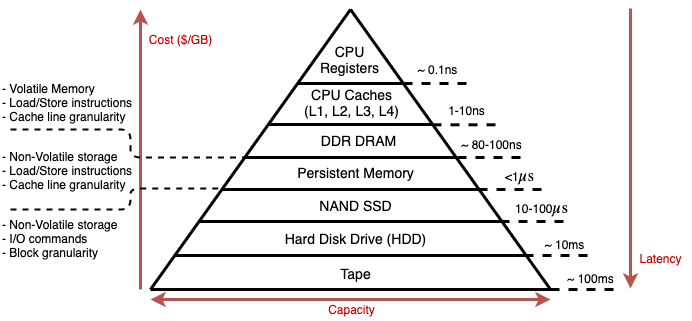
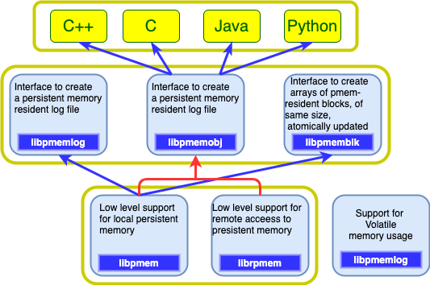

# Persistent_Memory

Application performance and security are undeniable parts of high-performance systems in datacenters. Hence, there are numerous number of studies in various layers of these systems that some of them are in infancy phase and rest of them are commercialized. In addition, distributed high-performance systems such as database systems or key-value stores which are widely used in production datacenters, need to be improved in various aspects. For example, there should be quite huge, byte-addressable, persistence and low cost memory systems in high-performance datacenters for applications like distributed databases. Also, there should be a secure, reliable and trusted mechanism to completely isolate applications' code and data from each other to prevent the occurrence possible attacks. According to Recent researches in, Intel proposed two products to address above mentioned issues: Intel Optane Persistent Memory (PMEM) and Intel Software Guard Extension (SGX). Intel Optane Persistent Memory (PMEM) promises byte-addressability, persistence, high capacity (128/256/512GB per DIMM), lower latency in read/write, lower cost than DRAMs and high performance, all on memory bus. Intel SGX enables user-level code to create private memory regions called enclaves, which code and data are protected by the CPU from any software and hardware attacks outside the enclaves. In fact, SGX provides a practical solution to the problem of secure computation on untrusted platforms such as multi tenant datacenters and public clouds.

Furthermore, with the emergence of Remote Persistent Memory (RPM), the developers have been studied to implement high-performance distributed systems on RPM with specific remote memory access, called Remote Direct Memory Access (RDMA). RDMA-based distributed systems use specific kinds of NICs, called RNIC which eliminates TCP/IP protocol stack for network connectivity. Therefore, it is not possible to implement high-performance distributed systems over commodity hardware. The problem also gets even more complex when these systems need strong security mechanisms to have confidentiality, integrity and freshness in untrusted environments. Some researches such as \cite{eRPC} and \cite{dspm} proposed mechanisms for distributed systems to access resources remotely with latency comparable to specialized hardware like RDMA. Yet, there are several works need to be added in these mechanisms such as security to prepare the whole system operable in un-trustable environments. As a result, there is a fundamental need to provide an infrastructure for developers to implement a secure and distributed high performance system over commodity hardware inside datacenters.

Persistent Memory or PMEM is a type of Non-Volatile memory (NVMem) which is directly connected to memory bus rather than PCI-e. PMEMs provide byte-addressability, persistence, and latency which is within an order of magnitude of DRAM.As shown in Figure, PMEMs provide a new entry in the memory-storage hierarchy which fills the perfromance/capcacity gap\cite{pmem.io}.

With PMEMs, applications have a new tier available for data placement. In addition to the memory and storage tiers, the persistent memory tier offers greater capacity than DRAM and significantly faster performance than storage. Applications can access persistent memory like they do with traditional memory, eliminating the need to page blocks of data back and forth between memory and storage.
PMEMs are built to work in two modes: Memory Mode where it acts exactly like DRAMs, and App Direct Mode where it plays the role of persistent memory. In App Direct Mode, software has a byte-addressable way to talk to the persistent memory capacity. In-memory databases restart time can also be significantly reduced because applications no longer have to reload data from storage to main memory, as they can access the persistent memory address space by using load/store accesses.

With the emergence of Intel's Optane Dual Inline Memory Module (DIMM) which is the most recent commercially available PMEM on the market, researchers in \cite{empirical} explored properties and characteristics of the product at different levels. Optane memory has several features as below:

1. Optane DIMM has higher density compared to DRAM, therefore, it is available in bigger capacities like 128, 256 and 512 BG per DIMM.
2. Optane DIMMs like traditional DRAM DIMMs sit on the memory bus, and connects to the processor's Integrated Memory Controller (iMC). iMC is responsible for maintaining the Optane DIMMs and DRAMs' functionalities.
3. Optane DIMMs operate in two modes: Memory, which CPU and OS simply see the DIMMs as a larger Volatile portion of main memory, and Direct mode, which behaves as a persistent memory.
4. Optane DIMM is both persistent and byte-addressable. It means that it can fill the role of either a main memory or a persistent device(e.g. SSD).

Applications access the Optane DIMM's content using store instructions which are the extended instruction Set Architecture (ISA), and those stores will become persistent.
PMEMs also introduce several new programming challenges such as:

1. CPUs have out-of-order CPU execution and cache access/flushing.  This means if two values are stored by the application, the order in which they become persistent may not be the order that the application wrote them.
2. If power outage happens during an aligned 8 bytes store to PMEM, either the old 8 bytes or the new one will be found in that location after reboot. In other words, 8 bytes stores are powerfail atomic.
3. As anything larger than 8 bytes is not powerfail atomic, it is up to the software to implement whatever Transactions are required for consistency.
4. Memory leaks to persistent storage are persistent.  Rebooting the server doesn't change the on-device contents.
5. Since applications have direct access to the persistent memory media, any errors will be returned back to the application as memory errors. So, applications may need to detect and handle hardware errors directly.

According to Figure, To get the low latency direct access, a new software architecture is required that allows applications to access ranges of persistent memory. The Persistent Memory Development Kit (PMDK) is a collection of libraries and tools for System Administrators and Application Developers to simplify managing and accessing persistent memory devices. The libraries are built on Direct Access (DAX) feature which allows applications to access persistent memory directly as memory-mapped file. Support for this feature is what differentiates a normal file system from a persistent memory-aware file system. Figure shows the model which describes how applications can access persistent memory devices (NVDIMMs) using traditional POSIX standard APIs such as read, write, pread, and pwrite, or load/store operations such as memcpy when the data is memory mapped to the application. For persistent memory, the APIs for memory mapping files are at the heart of the persistent memory programming model published by . The 'Persistent Memory' area describes the fastest possible access because the application I/O bypasses existing filesystem page caches and goes directly to/from the persistent memory media.

Unfortunately, most persistent memories are designed for the single-node environment. Also in an empirical observation it is mentioned that the it is unclear scalable persistent memories will evolve. So, with modern datacenters applicatoins' computation scale, we have to be able to scale out persistent memory systems and hide background complexities from application developers by providing suitable abstractions.
