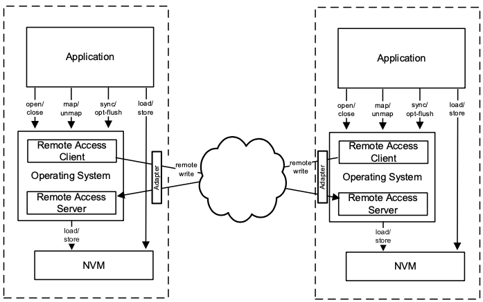

# Persistent_Memory

## Motivation

The emergence of dense, byte-addressable Persistent Memories(PMEMs) allows application developers to combine storage and memory into a single layer. With PMEMs, servers can equip terabytes of memory that survive power outages, and all of this persistent capacity can be managed with low latency. In other word, PMEMs promise byte-addressability, persistence, high capacity (128/256/512GB per DIMM), lower cost than DRAMs and high performance, all on memory bus[Dash]. The technology allows applications to access persistent data using load/store instructions, avoiding the need for a block-based interface utilized by traditional storage systems. The recent release of Intel Optane DC Persistent Memory Module(DCPMM) bring this vision closer to reality. If we see datacenter systems through the memory perspective, there are local memories and remote memories. Local memories refer to memories which reside near in CPU and are directly connected to it via memory bus. Remote memories refer to memories reside in remote hosts and can be achieved over the network using protocols and mechanisms such as message passing, RDMA and RPC. Therefore, accessing data remotely over remote persistent memory is called Remote Persistent Memory Access (RPMA).

Because of the abovementioned attractive features in PMEMs, developers have decided to implement distributed data-intensive systems like database systems and key-value stores on PMEMs. Specifically focusing on the latter, A key-value store, or key-value database, is a type of data storage software program that stores data as a set of unique identifiers, each of which have an associated value. This data pairing is known as a “key-value pair.” The unique identifier is the “key” for an item of data, and a value is either the data being identified or the location of that data. Key-value store with the simple abstraction of interfaces (i.e.,Put, Get) has become a fundamental component in datacenter infrastructures. Furthermore, as the number of servers increase, the more data with which we have to deal. Therefore, distributed key-value store is introduced. A distributed key-value store is built to run on multiple computers working together, and thus allows us to work with larger data sets. Using distributed key-value stores, we can increase processing performance, and if we leverage replication, we increase fault tolerance. 

### RDMA
 NVMMs appear to mesh perfectly with another popular technology, remote direct memory access (RDMA). RDMA gives a client direct access to memory on a remote machine and mediates this access through a memory region abstraction that handles the necessary translations and permissions. NVMM and RDMA seem eminently compatible: by combining them, we should be able to build network-attached, byte-addressable, persistent storage. Unfortunately, however, the systems were not designed to work together. An NVMM- aware file system manages persistent memory as files, whereas RDMA uses a different abstraction memory regions to organize remotely accessible memory. As a result, in practice, building RDMA-accessible NVMMs requires expensive translation layers resulting from this duplication of effort that spans permissions, naming, and address translation. At first glance, by combining NVMM and RDMA, we could unify storage, memory and network to provide large, stable, byte-addressable network-attached memory. Unfortunately, the existing systems used to manage these technologies are simultaneously overlapping and incompatible.  RDMA merges local and remote memory. RDMA allows a client to directly access memory on a remote server. Once the remote server decides to allow incoming access, it registers a portion of its address space as an RDMA memory region and sends the client a key to access it. Using the key, the client can enlist the server’s RDMA network interface (RNIC) to directly read and write to the server’s memory, bypassing the CPU. RDMA is popular as it offloads most of the networking stack onto hardware and provides close-to-hardware abstractions, exhibiting much better latency compared to TCP/IP protocol.

RPMA – Remote Persistent Memory Access

Latency is a key consideration in choosing a connectivity method for memory or storage. Latency refers to the time it takes to complete an access such as a read, write, load or store. There are two very important latency thresholds that change how applications see storage or memory represented by the background color bands in this figure. These thresholds are used by system designers when implementing access to stored data, to determine whether the access is to be synchronous, polled or asynchronous. In today’s large non-uniform memory access (NUMA) systems, latencies of up to 200 nS are generally considered to be acceptable. NUMA systems must be very responsive because CPU instruction processing on a core or thread is suspended during the memory access. Latencies of more than 200 nS in a memory system quickly pile up, resulting in wasted CPU time. On the other hand, when an application does IO for a storage access that is expected to take more than 2-3 uS, it will usually choose to block a thread or process. The CPU will execute a context switch and make progress on another thread or process until it is notified that the access is complete. For latencies between 200 nS and 2 uS it may be preferable for the CPU to poll for IO completion as this consumes one thread or core but does not slow down the rest of the CPU.

The concept of disaggregated memory is used to illustrate cases where memory that is not contained within a server is still accessed at memory speed. Disaggregated memory still looks like memory to CPU’s. It operates at memory speed in cache line size units and it may be subject to distance limitations to insure sufficiently low latency. Disaggregated memory is made scalable through the use of optical networks such as those based on silicon photonics to increase the distance of memory speed interfaces.
Networked memory is accessed through a high speed network rather than directly through a memory interface. Memory access is achieved over the network using protocols such as message passing and RDMA. Networked persistent memory is not cache coherent with the CPU. Unlike local or disaggregated persistent memory where all of the NVDIMMs can be part of a single system image, the NVDIMMs on a remote node are not part of a single system image.

The Optane DIMM is the first scalable, commercially avail- able NVDIMM. Compared to existing storage devices (in- cluding the Optane SSDs) that connect to an external interface such as PCIe, the Optane DIMM has lower latency, higher read bandwidth, and presents a memory address-based inter- face instead of a block-based NVMe interface. Compared to DRAM, it has higher density and persistence. At its debut, the Optane DIMM is available in three different capacities: 128, 256, and 512 GB.
